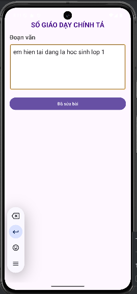
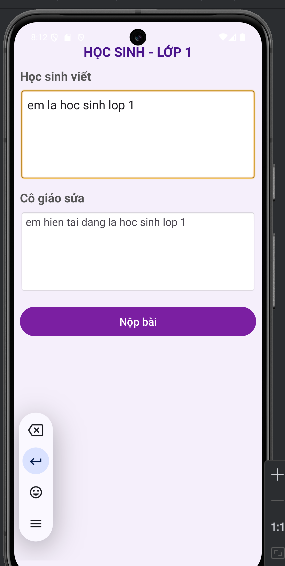

# Ứng dụng chỉnh sửa chính tả
## Giới Thiệu
Ứng dụng giúp học sinh nhập bài viết và gửi đến giáo viên để chỉnh sửa. Giáo viên có thể nhận bài, sửa lỗi và gửi lại kết quả cho học sinh.

## Tính Năng Chính
- **Học sinh nhập bài viết** vào ô văn bản.
- **Gửi bài viết** đến giáo viên bằng nút "Nộp bài".
- **Giáo viên chỉnh sửa** và nhấn nút đã sửa bài để gửi lại kết quả.

## Demo
  

## Tác giả
Nhóm 21
- 21200124 - Phạm Khánh Linh
- 21200158 - Lê Thị Uyển Nhi

